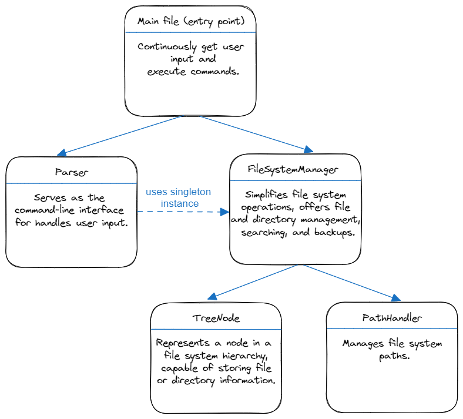

# File System

The File System is a command-line tool for managing a virtual file system. It allows you to create, read, write, delete, copy, move, and perform various operations on files and directories. This README provides an overview of the project and instructions on how to use it.

## Table of Contents
- [Structure](#structure)
- [Features](#features)
- [Installation](#installation)
- [Usage](#usage)
- [Testing](#testing)

## Structure
A diagram that illustrates the structure and relationships of the classes:



## Features

- Create directories and files with custom content.
- Read and display the content of files.
- Write content to files, with option for appending.
- Delete files and directories.
- Copy files and directories to new locations.
- Move files and directories to new locations.
- List the contents of directories, optionally recursively.
- Get the size of files and directories in bytes.
- Get creation and last modification times of files and directories.
- Search for files and directories based on specific criteria.
- Change the current working directory.
- Navigate to the previous directory.
- Quit the program and Create a Backup.

## Installation

1. Clone the repository to your local machine:
   ```bash
   git clone https://github.com//AdielGoetschel/FileSystem.git
   cd FileSystem
2. Install Dependencies:
   ```bash
   pip install -r requirements.txt
3. You're now ready to use the File System Manager.

## Usage

To use the File System Manager, you can run the `main.py` file. It provides a command-line interface for interacting with the virtual file system. Here's a basic usage example:

1. Open a terminal or command prompt.

2. Navigate to the directory where your project is located.

3. Run the following command:
   ```bash
   python main.py
   ```
   You'll be prompted to enter commands to perform various file system operations.

4. - `help` Command: The "help" command provides a list of available commands with short explanations. It offers an overview of the actions you can perform in the File System.
   - `command_name --help`: By appending --help to a specific command (e.g., `create --help`), you can access detailed information about that command, including its usage and arguments.
## Testing
Unit tests for the File System are organized into separate test files for each class, as well as tests for the main file. These test files are located within the "tests" subdirectory. You can run all these tests using the following command:
```bash
python -m unittest discover -s tests -p "test_*.py"
```


